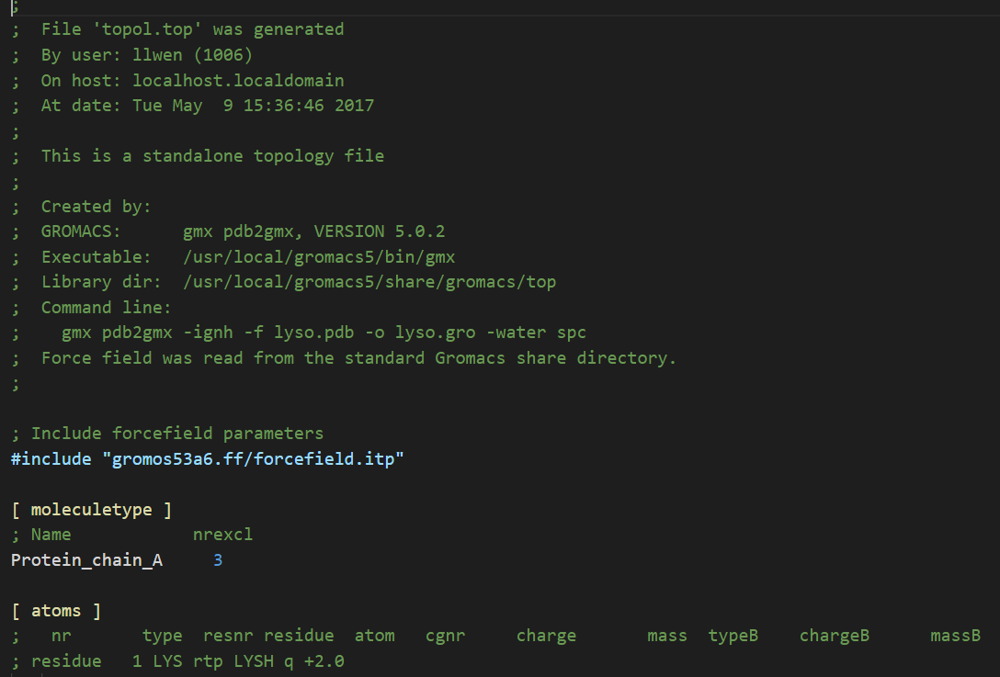
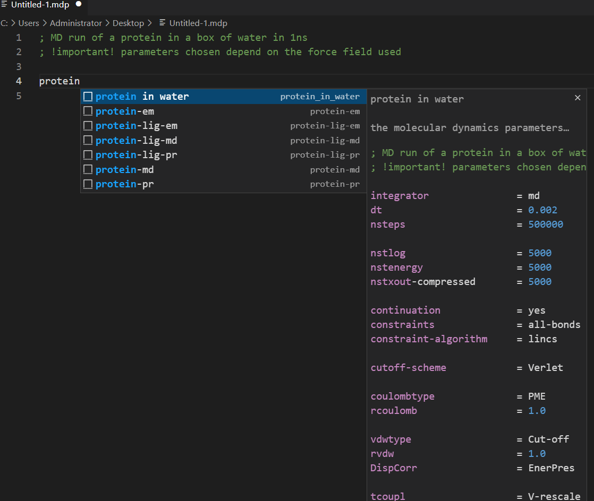
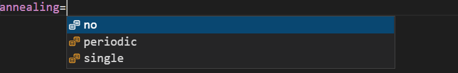

# gmxlang README

My first vscode extension.

## Features

The `gmxhelper` extension is a vscode extension to generate regular mdp files and highlight the syntaxes.

Now this extension supports the following file types:

- .top
- .mdp

The usage is shown in the following figures.

## Release Notes

### 0.0.1

Initial release of gromacs input file extension for a test

---

**Enjoy!**